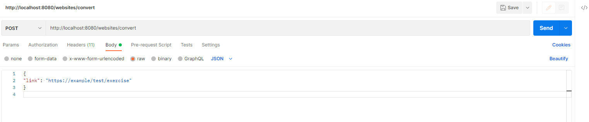
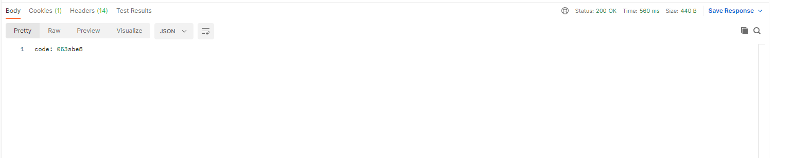
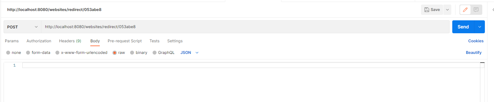
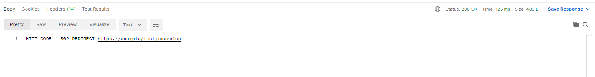
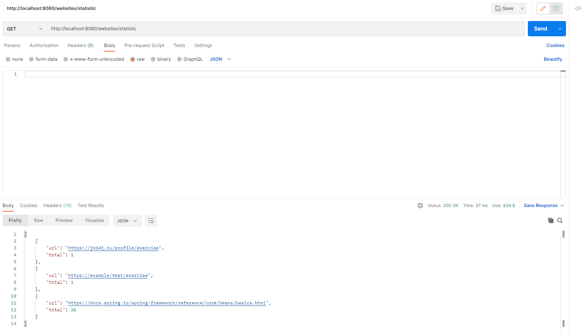
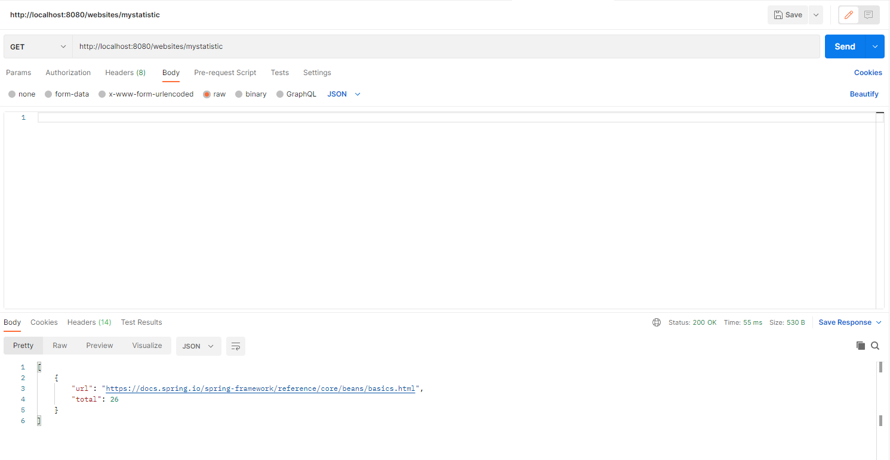

# UrlShortCut
## О проекте:
Чтобы обеспечить безопасность пользователей, все ссылки на сайте заменяются ссылками на наш сервис.
Сервис работает через REST API.

### Технологии

__Java17__
__Maven 3.8__
__PostgreSQL__
__Spring boot__
__Spring security__
__Liquibase__

 


#### Запуск проекта:
Перед запуском приложения необходимо создать базу данных urlShortCut в PostgreSQL 14
с помощью команды ```create database urlShortCut```
после чего необходимо запустить скрипты из папки job4j_url_shortcut\db\scripts.
Затем необходимо открыть и запустить класс src/main/java/ru/urlshortcut/UrlShortCutApplication.java.

#### Взаимодействие с приложением:
Рассмотрим использование приложения через Postman:

В Postman отправляем post-запрос по ссылке: http://localhost:8080/websites/registration

В теле запроса передаем название сайта:


Если сайт не загружен в систему, в качестве ответа получим сгенерированный логин и пароль:


Для входа в систему нужно отправить post-запрос по ссылке: http://localhost:8080/login

В теле запроса передаем сгенерированный логин и пароль:


В качестве ответа в одном из заголовков получаем сгенерированный авторизационный ключ:


Необходимо скопировать данный ключ, перейти в заголовки запросов и скопировать содержимое ключа:


Далее можно приступать к работе с сервисом.
Токен авторизации будет действителен в течение 10 дней.

После успешной авторизации для работы с приложением нужно отправить post-запрос по ссылке:
http://localhost:8080/shortcuts/convert

В теле запроса нужно передать адрес ссылки, которую нужно зашифровать:


В качестве ответа в теле получаете код для вашей ссылки:


Для перехода по ссылке с помощью сгенерированного кода нужно отправить get-запрос формата 
http://localhost:8080/shortcuts/redirect/ ваш сгенерированный код:


Если вы все ввели верно, вам вернется ответ с предложением перейти по вашей ссылке:


В приложении ведется подсчет запросов redirect по сгенерированным кодам.
Есть возможность посмотреть статистику переходов по ссылкам всех зарегистрированных сайтов, 
а также посмотреть статистику по своим ссылкам.

Для того, чтобы посмотреть общую статистику, нужно отправить get-запрос по ссылке:
http://localhost:8080/shortcuts/statistic


Для того, чтобы посмотреть статистику только по своим ссылкам, нужно отправить get-запрос:
http://localhost:8080/shortcuts/mystatistic


#### Контакты
Телеграм:
[Связаться со мной](https://t.me/relaxedlife05)