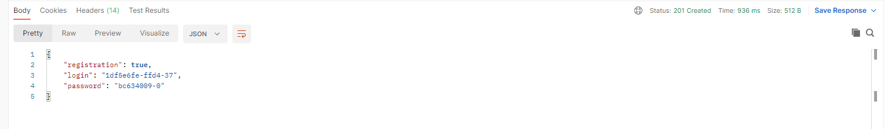
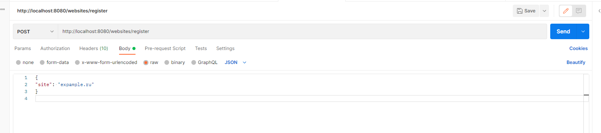
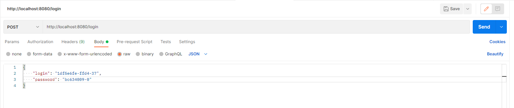
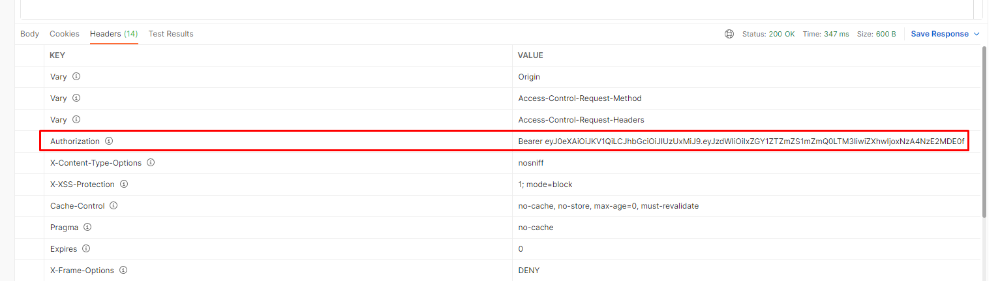
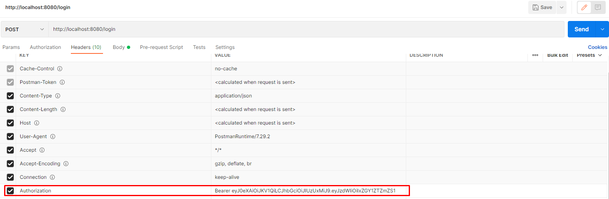

# UrlShortCut
## О проекте:
Чтобы обеспечить безопасность пользователей, все ссылки на сайте заменяются ссылками на наш сервис.
Сервис работает через REST API.

### Технологии

__Java17__
__Maven 3.8__
__PostgreSQL__
__Spring boot__
__Spring security__
__Liquibase__

 

#### Запуск проекта:
in process

#### Взаимодействие с приложением:
Рассмотрим использование приложения через Postman:

В Postman отправляем post-запрос по ссылке: http://localhost:8080/websites/registration

В теле запроса передаем название сайта:

Если сайт не загружен в систему, в качестве ответа получим сгенерированный логин и пароль:

Для входа в систему нужно отправить post-запрос по ссылке: http://localhost:8080/login

В теле запроса передаем сгенерированный логин и пароль:

В качестве ответа в одном из заголовков получаем сгенерированный авторизационный ключ:

Необходимо скопировать данный ключ, перейти в заголовки запросов и скопировать содержимое ключа:

После этого можно приступать к работе с сервисом.
Токен авторизации будет действителен в течение 10 дней.

#### Контакты
Телеграм:
[Связаться со мной](https://t.me/relaxedlife05)